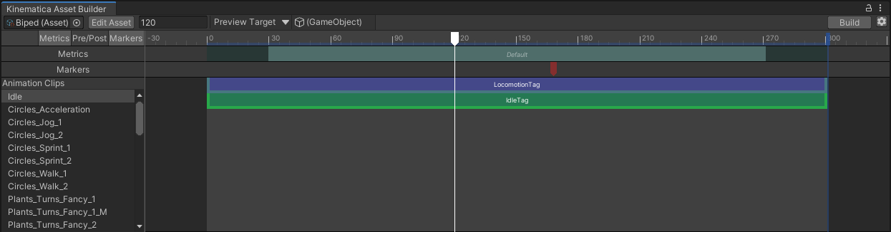
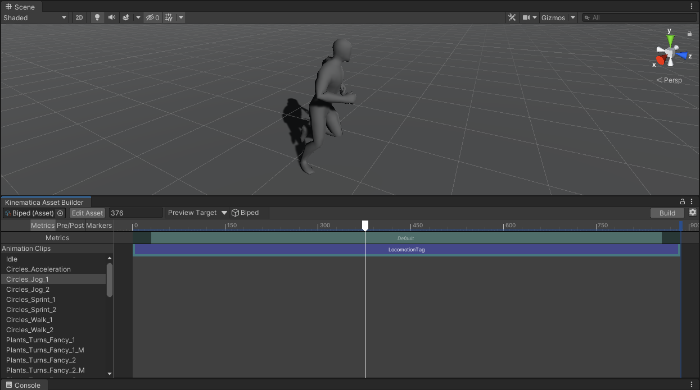
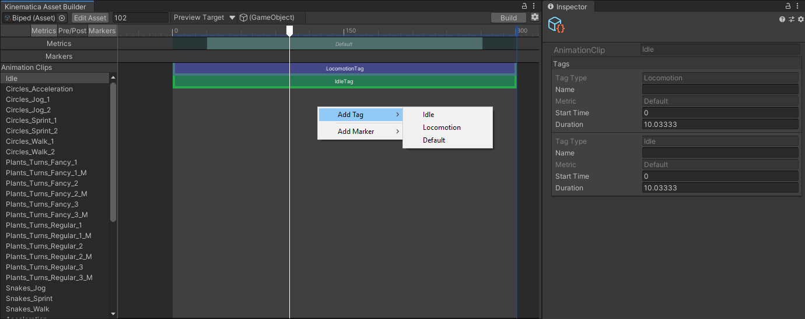
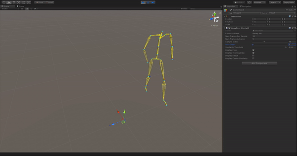
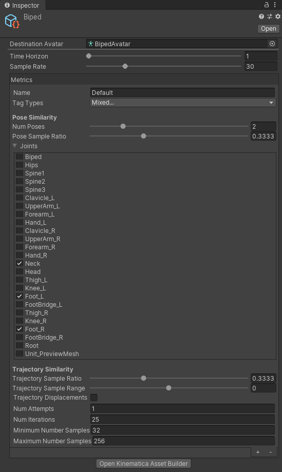

# Kinematica Asset Builder

The Kinematica Asset Builder is the central tool in Unity that allows the creation and modification of the Kinematica motion library. It also offers debug functionality in Play Mode to visually inspect Kinematica's runtime components.

The Asset Builder Window can be accessed from the `Window -> Animation -> Kinematica Asset Builder` menu.

## Editor Asset and Runtime Asset

Kinematica separates the motion library into an editor-only and a runtime-only asset. The Asset Builder Window operates on the editor-only asset and allows the creation of the runtime-only asset. The runtime-only asset can be generated at any time by clicking the `Build` button in the upper right corner of the Builder Window.

## Overview

A new Kinematica asset can be created from the `Project` context menu, `Create -> Kinematica -> Asset` or from the Kinematica Asset Builder Window (if no asset is currently selected).

The Asset Builder Window is divided into the following sections:

* Animation Clips
* Timeline

The list of animation clips refers to an arbitrary number of regular Animation Clips. Clips can be dragged from the `Project` window into the `Animation Clips` section of Kinematica's Builder Window. This generates a reference to the Animation Clip and it will become part of the motion library.

Selecting an animation clip reference will display annotations that have been made for this particular clip in the timeline section of the Builder Window. In addition to this functionality, selecting an animation clip allows to preview the animation clip in the scene view.

Kinematica uses the concept of tagging to associate semantic information to a either a sequence of animation poses or a single discrete animation frame. Tags are used to annotate sequences of animation poses and markers are used to annotate a single discrete animation frame. We collectively refer to tags and markers as annotations.

## Animation Preview

Right above the timeline section of the Builder Window is a `Preview` button and a scene object reference selector located.

A scene object with a compatible character setup can either be dragged onto the preview selector or can be selected from a list by clicking on the selection button at the right side of the preview selector. The `Preview` button will be enabled once a scene object has been selected. Clicking on the preview button toggles turns the preview mode on and off. During preview the white playhead which is located in the timeline area can be dragged left and right to select the current preview frame.

## Annotations

In order to annotate an animation clip in the motion library it has to be selected from the `Animation Clips` list. The timeline view then shows the corresponding annotations. By default Kinematica inserts a `Default` tag that spans the entire duration of the clip. The rationale behind this is that only animation frames that are annotated will be included in the runtime asset.

Right-clicking in the timeline area of the Builder window will show a context menu that allows to create new tags and new markers. The contents of this menu depends on the user defined tags and markers. For more information on how to create custom tags and markers, see the [Query Language](Query-Language.md) section of this documentation.

Tags can be adjusted by dragging the left or right boundary to adjust the length and by dragging the tag annotation itself to adjust the position. Similarly, markers can be dragged to adjust the positioning. Tag and marker properties will be shown in the inspector (right hand side in the image above). Tags always have a start time and a duration, whereas markers only have a start time. The custom payload of the corresponding tag/marker will be shown under the default properties in the inspector.

## Metrics and Fragments

Kinematica's core concept centers around evaluating the similarty between poses and/or trajectories. Details regarding this topic can be found in the [Overview](Overview.md) and the [Task Graph](Task-Graph.md) section of this documentation.

In order to calculate the similarity between poses and/or trajectories Kinematica extracts certain characteristics from each animation frame (and its local neighborhood). The extracted characteristics for an animation frame are called `Fragments`. An example is shown in the image above. It is worth noting that a single fragment not only contains information about a single animation frame but also includes information about neighboring frames in order to be able to a) reason about movement across a longer time horizon and b) include information about velocity.

This process is mostly taken care of automatically behind the scenes and users only have to specify which characteristics are relevant for a given context. `Metrics` is the terminology that Kinematica uses to describe how and where fragments should be constructed in order to perform similarity calculations at runtime.

Metrics define the rules for how to construct fragments for poses and trajectories. Kinematica combines this concept with tag annotations, i.e. a tag can optionally specify which metric should be used for the animation frames that are covered by a given tag. In case multiple tags are used to annotate a certain range of animation poses the topmost tag defines which metric should be used.

In the image above we can see that 2 tags have been used to annotate the selected animation clip - `LocomotionTag` and `IdleTag`. Above the list of tags we can see the `Metrics bar` which indicates which metric is used and what ranges are covered. It should be noted that it is perfectly legal to not use metrics, but Kinematica's runtime will only be able to perform similariy calculations for animation poses that define metrics. In other words, the process of selecting animations at runtime has to soley rely on semantic filtering if a given tag does not specify which metric it should use.

Clicking on the `Edit Asset` button in the top row of the builder window or selecting the Kinematica asset in the project window will display the global asset settings in the inspector like shown in the image above.

The `Metrics` section of the asset settings describe the rules for how to generate fragments and their relationship to tags. Users can define multiple rules by creating new metrics using the `+` button at the bottom of the metrics section. Each metric has a name shown at the top. Metrics describe for example which rig joints participate in a pose comparison which is loosely related to semantic annotations, i.e. tags. For example, a metric can describe to use both feet and hands for pose comparison. This metric could then be used to match poses during locomotion as well as climbing.

Right under the name of a metric is the `Tag Types` dropdown located. Here, users can specify which tags the given metric applies to. Like mentioned above, the tags are evaluated top-to-bottom on the timeline to determine which metric should be used for any given animation frame in case multiple metrics refer to the same tag type.

The remaining portion that describes a metric is devoted to defining the comparison rules for poses and trajectories respectively. These settings are explained below.

### Pose Similarity

The pose similarity section for a metric describes the rules for pose comparisons.

* `Num Poses` defines the number of poses that should contribute to a pose comparison in addition to the pose the given fragment will be constructed from. In other words, this number defines how many neighboring poses should be included in order to compare joint velocities. A value of 2 includes a single future pose and a single past pose (future and past are relative to the reference pose, i.e. the pose the fragment will be constructed from).

* `Pose Sample Ratio` defines how many individual samples should be taken across the total number of poses to contribute to a pose comparison. Pose comparisons always include at least a single pose and can optionally cover neighboring poses in order to take joint velocities into account. The pose sample ratio allows to add or remove joint samples without affecting the total time horizon that each individual pose fragment covers. A value of 0.3 means that we take 3 samples across the total number of poses (see the `Num Poses` setting above).

* `Joints` defines which joints should contribute in a pose comparison. The joints shown in the list are extracted from the destination avatar setting (see below in the global asset settings section). In general, the joints that should be included in this list should be the joints that make frequent contact with the environment and additionally the ones that have a high or very high variation across the poses that this metric will be comparing against. If too many joints are included, the pose comparison will be too restricted and will tend to return results that are too biased towards a single pose. Motion Matching works best if it has a large number of poses to choose from since we usually have to find a compromise between a matching pose and a matching trajectory.

The pose similarity settings collectively define how much memory a single pose fragment requires and how expensive the pose comparison will be at runtime. As a general rule of thumb, the less samples and the less joints you can get away with, the better.

### Trajectory Similarity

* `Trajectory Sample Ratio` defines how many individual samples should be taken across the time covered for any given trajectory fragment. Trajectories can span a duration up to the time horizon that is specified by the global time horizon setting (see below in the global asset settings section). The trajectory sample ratio allows to add or remove transform samples regardless of the trajectory duration. A value of 0.3 means that we take 3 samples across the total duration.

* `Trajectory Sample Range` defines the length of the trajectory w.r.t. the global time horizon setting. A value of 0 indicates that the generated trajectory fragment should only cover the range that starts at the reference pose and extends to the full range of the time horizon. A value greater than 0 (up to 1) will cover only the "future" portion of the trajectory and a value less than 0 (up to -1) will include a portion of the "past" trajectory and up to the full "future" trajectory as described by the time horizon.

* `Trajectory Displacements` denotes whether or not root displacements should be included in the trajectory fragment generation. By default this setting is off and trajectory fragments only include root velocities and forward directions of the root transform sampled across the trajectory range. In certain cases it is beneficial to include the actual displacement between root samples. Trajectories are essentially curves and velocities are tangents of that curve. Tangents are an approximation of the actual shape of the curve and this might not be sufficient in certain cases to describe the shape accurately without increasing the sample rate. Including the actual displacements between samples is an alternative solution - which highly depends on the animation data that is being used.

### Learning Parameters

The learning parameters at the bottom of a metric control the learning process that is being used during the build process. Pose and trajectory fragments are stored in the runtime asset in a highly compressed format which is uses a combination of principal component analysis, k-means clustering and PQ encoding. The settings in this section only control the clustering portion of the learning process.

* `Num Attempts` - Since k-means clustering is a stochastic process we can execute multiple attempts to arrive at a good solution. Usually the first attempt yields a good result, but in case the data contains a high variation multiple attempts might be required. As a general rule of thumb, start with a value of 1 and increase if required or separate the data included in this metric across multiple metrics. The higher the number, the more time will be required during the learning step.

* `Num Iterations` - Specifies the number of iterations for k-means clustering. The higher the number of iterations, the more accurate the result. Again, as a rule of thumb, start with a low number of and increase if required. The higher the number, the more time will be required during the learning step.

* `Minimum/Maxiumum Number Samples` - Denotes the number of random samples drawn from the data set, i.e. from the set of fragments covered by this metric. Too few samples will reduce the overall accuracy and therefore the quality of the matching quality; too many samples will increase the time spend during the learning step. Again, start the the default numbers and adjust if necessary. If the matching result does not meet the desired quality it is generally better to split the data into multiple metrics.

### Gloabl Asset Settings

* `Destination Avatar` - Avatar that defines the structure of the animation rig that is to be used for animation clip sampling.

* `Time Horizon` - Global duration that affects trajectory prediction and trajectory fragment generation. The time horizon is measured in seconds and should be long enough to be able to reason about movements. Most bipedal movements cover a range of roughly 1 second - think of elaborate plant-and-turn movements or any movement that requires some time to perform. The time horizon should be just long enough to cover such movements. The longer the time horizon, the more difficult it becomes to reason about a single movement since movements start to "bleed" into each other as the time horizon increases. As a general rule of thumb, start with a short time horizon and increase if the necessary.

* `Sample Rate` - Global sampling rate that will be used during the asset build process in order to re-sample the referenced animation clips to ensure a consistent sampling rate across multiple disjoint animation clips.
