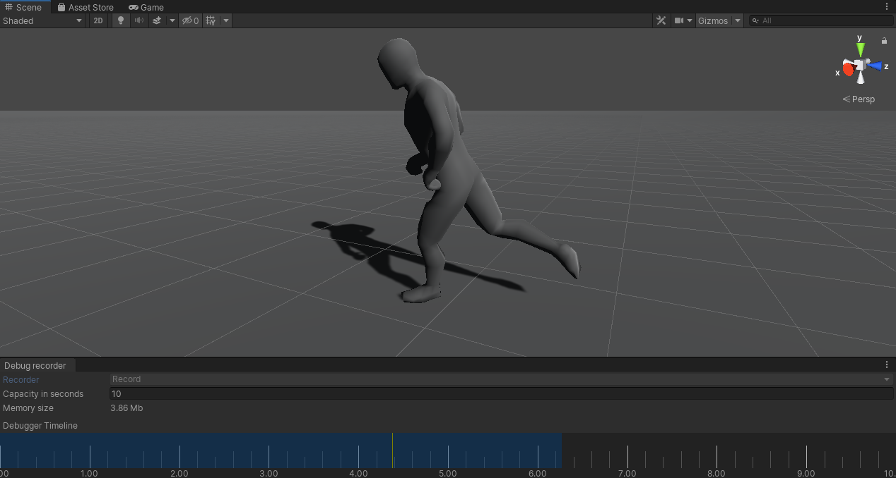
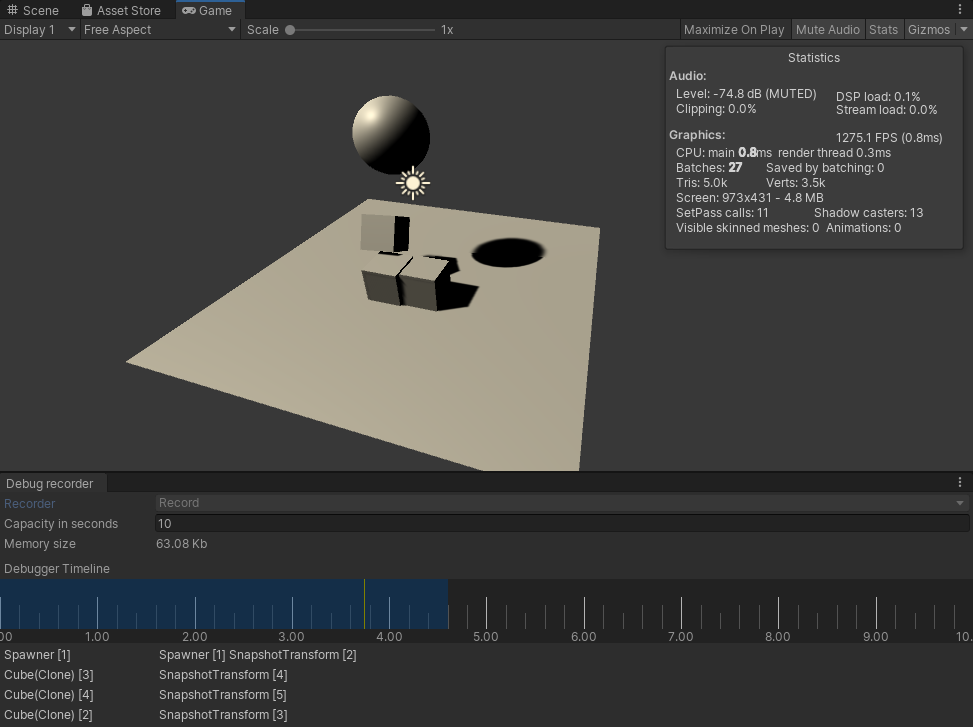
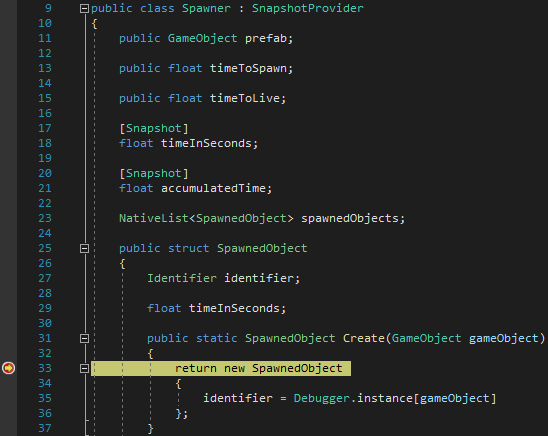

# Kinematica Snapshot Debugger

The snapshot debugger is a general record / rewind debugging system for game objects.

During play mode the debugger records the internal state of game objects and its components into a buffer. At a later time, it allows to restore any previously recorded state and to re-execute each frame. For example, setting a breakpoint in your favorite IDE in any method that was executed when the frame was originally recorded will be triggered during rewind - with the exact state the object was in when it was recorded.



The above image shows the Snapshot Debugger below the scene view. It can be accessed by the `Window -> Analysis -> Snapshot Debugger` menu.

The timeline section of the Snapshot Debugger displays the range of recorded frames in blue. The `Capacity in seconds` determines the size of the internal recording buffer. In the example shown above it is set to 10 seconds, which in turn means that the range of recorded frames won't exceed this amount of time. The corresponding memory size (shown below the capacity in seconds) shows the size of the recording buffer. The higher the recording capacity the more memory will be required for the recording buffer.

The recorder can only be used in playmode and is inactive by default (for performance reason). You start, pause/resume and stop recording at any time during playmode by clicking on the corresponding buttons in the Snapshot Debugger window.

During record mode a left mouse-click in the blue area that indicates the section of frames that have been recorded will switch the Snapshot Debugger into rewind mode. The currently selected time will always be indicated by the yellow playhead. During rewind mode the current time can be selected by "scrubbing" along the timeline area.

Kinematica's Builder window and Execution Graph window will automatically display the internal state of the motion synthesizer at the current rewind time.

## User defined Snapshot Debugging

A game object component can register with the snapshot debugger in order to enable the record / rewind feature for it by deriving from `SnapshotProvider` instead of `MonoBehavior`. Individual properties can then be flagged to serialize their state by using the `Snapshot` attribute. In addition to that the `SnapshotProvider` base class offers the methods `WriteToStream` and `ReadFromStream` which can be used to write custom data into the snapshot buffer or read data out of it in order to perform custom serialization.

The following code sample shows an example usage:

```
public class Example : SnapshotProvider
{
    [Snapshot]
    float someProperty;
}
```

The `Snapshot Debugger` example in the package contains a more complete use case. It shows custom serialization as well as how to perform snapshot debugging for dynamically spawed object.

The Kinematica component records its internal state automatically and user code does not need to perform any additional steps in order to enable snapshot debugging when using the Kinematica component.

## Snapshot Debugger Workflow

The snapshot debugger enables a powerful workflow. Since the debugger records the internal state at the beginning of each frame it is possible to "re-live" any previously recorded frame under the exact same conditions.



The image above shows a screenshot from the accompanying sample project for the snapshot debugger. It is a rather trivial example that shows a moving sphere that spawns and destroys some boxes which fall onto the ground.



Let's assume that we are in play mode and obtained a couple of seconds worth of recording before we start rewinding. The play mode appears to be paused but the entire frame-by-frame logic still executes but the starting conditions for each frame are overridden by the snapshot debugger.

We can now attach our IDE to Unity and set a breakpoint at some location that we would like to inspect, like shown in the image above. Scrubbing along the snapshot debugger timeline until we reach a frame where one of the objects were spawned will trigger the breakpoint. This now enables us to debug this exact situation as it was initially encountered. This can for example be used in scenarios that involve collision handling and resolution, which is traditionally very hard to debug. And of course, debugging animation glitches is also notoriously hard unless we can work with snapshot debugging.

It should be noted that it is up to the user to record the necessary properties in order to recreate the exact same condition for a system or component in question. As an example, `Time.deltaTime` will always slightly fluctuate and Kinematica maintains the delta time for any given frame as an internal property in order to ensure that the exact same result will be produced in any given frame. Another example is peripheral input (gamepad, mouse, keyboard). In order to recreate the same inputs user scripts should record the inputs alongside other state properties.
