# Getting Started with Kinematica

## Installing Biped locomotion sample

The Kinematica package contains a number of sample projects that serve as a starting point to understand the concepts and the workflow.

The individual sample projects can be directly installed from the Package Manager. Click the `Import into project` button next to a sample project.

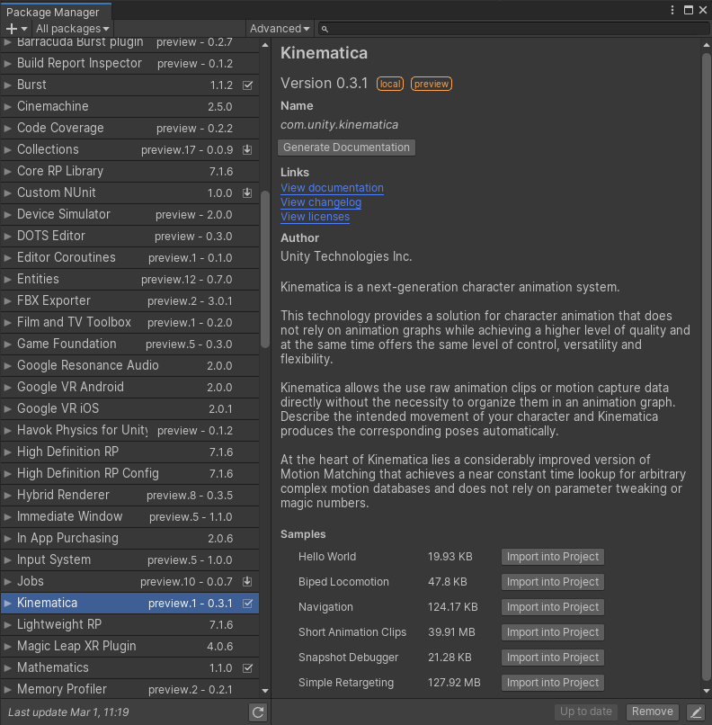

The `Biped Locomotion` sample contains a simple locomotion setup for a bipedal player controlled character.

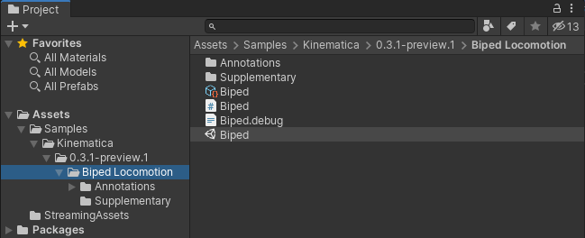

Load the `Biped` scene from the `Biped Locomotion` sample project.

Now open the Kinematica Asset Builder window `Window -> Animation -> Kinematica Asset Builder` and select the `Biped` Kinematica asset. The Asset Builder is the central tool in Unity that allows the creation and modification of the Kinematica motion library. It also offers debug functionality in Play Mode to visually inspect Kinematica's runtime components.

The Kinematica Asset Builder is described in detail in the [Asset Builder](Builder.md) section.

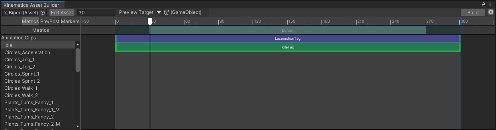

Kinematica deviates from the usual way of handling assets in Unity. The motion library asset needs to be built before it can be used in play mode. The build step pre-processes the referenced animation clips and generates a memory-ready binary runtime-only asset. The Kinematica asset builder allows to build the runtime asset from the editor asset.

Click the `Build` button in the upper right corner of the Kinematica Asset Builder window to build the runtime asset from the editor project. Make sure to enable Burst compilation (Jobs -> Burst -> Enable Compilation), the build process should then only take a few seconds.

Once this build step of the runtime-asset has been completed, enter play mode.

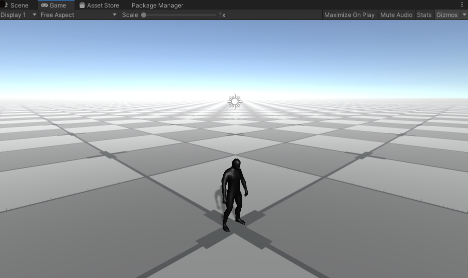

The character can be controlled by using the WASD keys or by using a gamepad.

Selecting the `Biped` game object in the hierarchy window will show the components that are used in this sample setup.

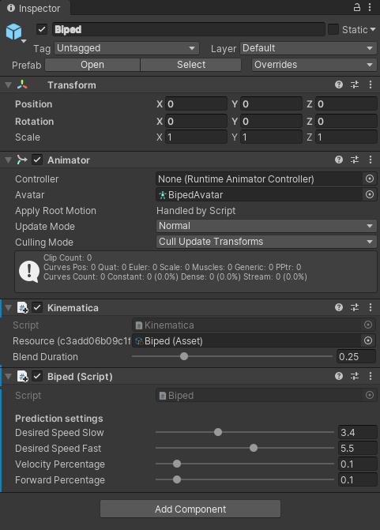

The `Kinematica` component is the central part of this setup that contains the motion synthesizer. It references the asset that we built in the previous step and drives the frame-by-frame generation of animation poses.

## Using Kinematica with C#

The `Biped` component is a simple MonoBehavior script that contains the game code interfacing with Kinematica.

### Motion matching update loop

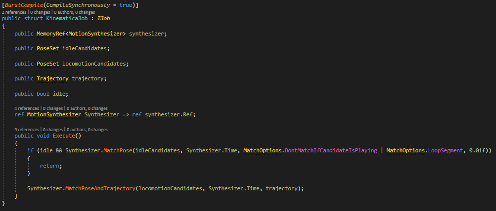

The image above shows a Burstable job meant to be executed every frame in order to animate the character with Kinematica. It's possible to call Kinematica API functions directly from a `MonoBehavior` update function for instance, but it's always better to do it from a `Burst` job for better performances, motion matching functions being quite performance intensives.

In the code snippet shown above, we animate a complete character locomotion made of 45 minutes of mocap animations with only 2 function calls :

- `Synthesizer.MatchPose()` is called if an idle animation (where the character is stationnary) is required. This function will look in the `idleCandidates` poses for the pose that is visually the most similar to the current pose (`Synthesizer.Time`, the character pose displayed previous frame on screen).
If a sufficiently similar pose has been found (meaning its dissimilarity distance with current pose is lower than `0.01f`, the last parameter of the function, we use this threshold to ensure smooth transition from moving to idle), this pose will be picked as the new current pose, and will be displayed on screen this frame.
`MatchOptions.DontMatchIfCandidateIsPlaying` ensures we don't look for another match if the current pose is already from `idleCandidates`. Indeed, idle animations being stationnary, once we found an idle pose, we just playback the corresponding idle clip starting from that pose.
- If idle animation hasn't been requested or no suitable idle pose has been found, we call `Synthesizer.MatchPoseAndTrajectory()` to look in `locomotionCandidates` poses for the pose that is both visually similar to the current character pose, and whose future trajectory is similar to the desired trajectory `trajectory` computed from user input.
Calling this function every frame will make sure we pick a pose that match user desired movement and is a smooth transition from the previous pose.

There are some obvious similarities to traditional animation graphs here at a first glance. The difference is that the code that executes as part of a Kinematica is completely user defined.

A much more elaborate example project that shows various different character abilities can be found [here](https://github.com/Unity-Technologies/Kinematica).

### Initialization

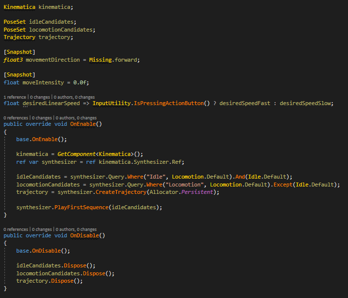

The image above shows the initialization of variables of `Biped` MonoBehavior script that will be used by Kinematica. Those variables will be initialized in the `OnEnable()` function of the MonoBehavior, and will symetrically be disposed in the `OnDisable()` function.

`idleCandidates` and `locomotionCandidates` are computed by gathering all the poses from the motion library in the Kinematica Asset that match the queried tags.

We also initialize the current pose in the synthesizer by picking the first pose from `idleCandidates`.

`moveIntensity` and `moveDirection` stores the user movement input retrieved from joystick or keyboard, they have the `[Snapshot]` attribute in order to be saved during Snapshot Debugger recording, in order to be later restored when rewinding with de debugger.

### Update functions

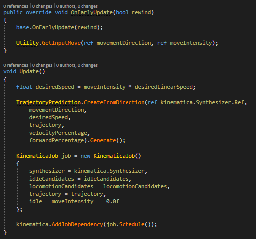

The image above shows the `EarlyUpdate()` and `Update()` methods from the `Biped` script.

All user inputs (buttons pressed, mouse...) should be retrieved in the `EarlyUpdate()` function and stored in variables with `[Snapshot]` attribute.
Indeed, Snapshot Debugger will save or load the entire game state (depending of whether the current mode is in record or rewind) between `EarlyUpdate()` and `Update()` calls.
- If the Snapshot Debugger is inactive or recording, `Utility.GetInputMove(ref movementDirection, ref moveIntensity)` will retrieve the user input movement from keyboard/gamepad and store it in `moveIntensity` and `moveDirection`.
Those variables will then be saved in Snapshot save-game-state function, and then be processed by the Biped `Update()` function.
- If the debugger is in rewind mode, `Utility.GetInputMove(ref movementDirection, ref moveIntensity)` will do nothing, instead `moveIntensity` and `moveDirection` will be restored with the values they were set during recording by Snapshot restore-game-state function, and then they will be processed by the Biped `Update()` function.

This workflow allows inputs to be resimulated when rewinding with debugger, keeping `Update()` function agnostic from the current state of the Snapshot Debugger (recording, rewinding or inactive).

The `Update()` function is very simple : it computes the future `trajectory` from user movement input (`moveIntensity` and `moveDirection`), and feed it to the biped `KinematicaJob` that is then scheduled to be executed this frame.
`kinematica.AddJobDependency(job.Schedule())` will ensure that this job will finish execution before the Kinematica internal animation job start to execute. This animation job will generate the current pose from `Synthesizer.Time`, itself written inside `KinematicaJob` execute function.

## Debugging Kinematica

### Snapshot Debugger

Kinematica debugging relies on the Snapshot Debugger : `Window -> Analysis -> Snapshot Debugger`.
During playmode, you can start recording by clicking on `Start Recording` button (the debugger is inactive by default since it can be performance intensive), and select the target you want to debug in the `Target` dropdown list in the debugger window.

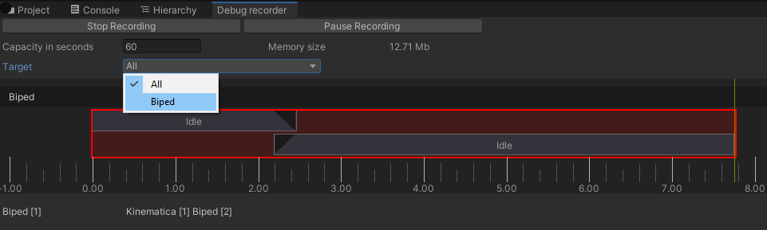

During recording, you can then pause gameplay by clicking on `Pause Recording` button in the debugger, and you can scroll back at any time in the debugger timeline with the mouse.

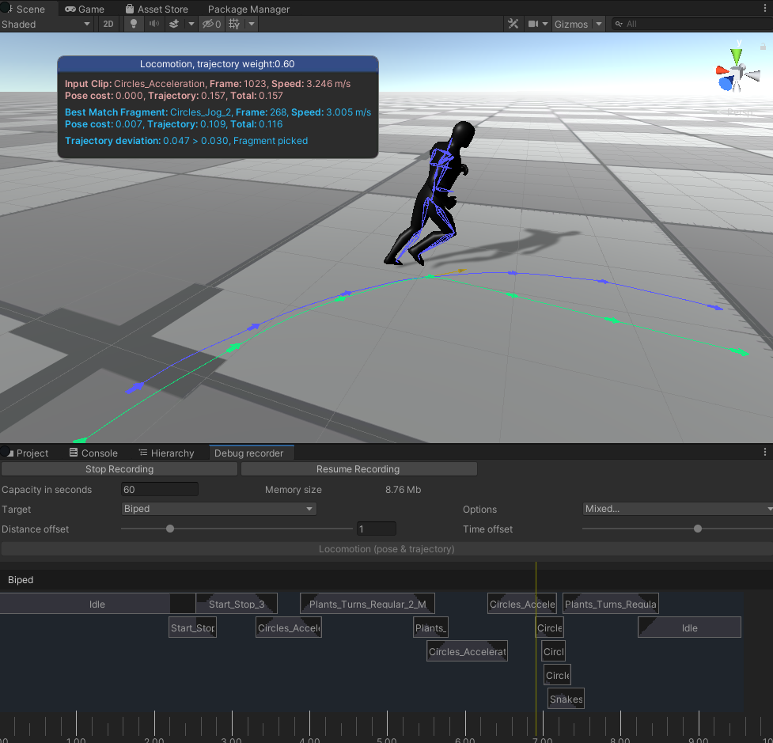

Debug information about the current motion matching query will be displayed on screen.
In the screenshot above, you can see the current pose (`Circle_Acceleration`, frame 1023, stored in `Synthesizer.Time`) and the best pose found by `Synthesizer.MatchPoseAndTrajectory()` called in `KinematicaJob` execute function (`Circle_Jog_2`, frame 268).
This pose and its future trajectory are drawn in blue on screen. You can see this trajectory is quite close (but not equal) to the input trajectory from user drawn in green (`trajectory` variable in `KinematicaJob`).

In some cases, there will be more than one motion matching query per frame (when `Synthesizer.MatchPose()` and `Synthesizer.MatchPoseAndTrajectory()` are both called in the `KinematicaJob` execute function, meaning we wanted to output an idle pose, but we didn't find any acceptable match, so we fallback on locomotion).
You can chose which query you want to debug by clicking on the corresponding button in the Snapshot Debugger (`Match Idle (pose only)` or `Locomotion (pose & trajectory)`).

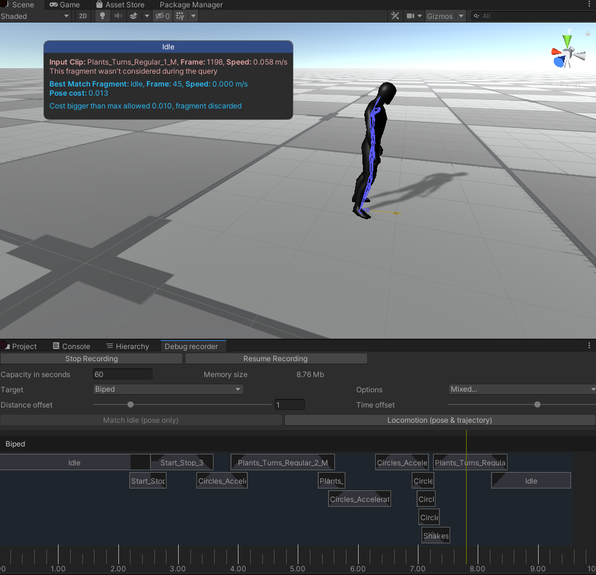

### Execution Graph

For more detail information, you can also visualize the Kinematica Execution Graph for the current frame by opening the corresponding window : `Window -> Analysis -> Kinematica Execution Graph`.

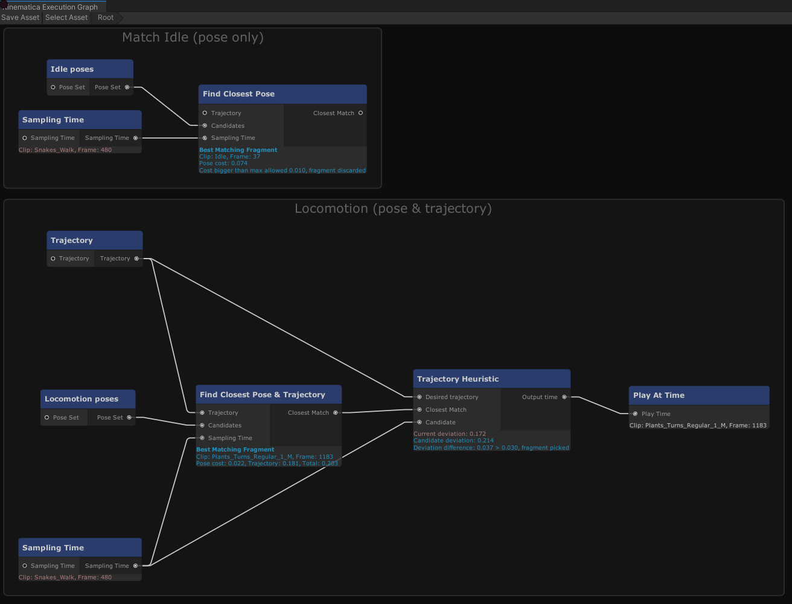

This graph is automatically generated based on the Kinematica function calls made during the frame, and displays how information is processed from one Kinematica core component to the other.

Blocks are displayed from top to bottom in their order of execution.
In the screenshot above, you can see that a motion matching query on idle poses has been made (`Synthesizer.MatchPose()`) but no acceptable match were found (the best match, clip `Idle` frame 37, had a dissimilarity distance of 0.074 with current pose, which is bigger than the maximum allowed of 0.01).
Then a motion matching query on locomotion poses has been made, choosing pose from clip `Plant_Turns_Regular_1_M` frame 1183).

Further information regarding Kinematica can be found in the [Kinematica concepts and overview](Overview.md) section of this documentation.
