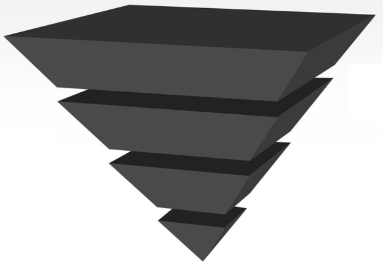

# Kinematica Semantic Query Language

The motion library that is contained in Kinematica's runtime asset can contain any number of animation poses that for any non-trivial setup contain poses that are semantically different. As an example, a motion library can contain different movements like locomotion, climbing, swimming, flying, etc.

Before attempting to perform any kind of pose or trajectory matching, Kinematica relies on semantic queries to reduce the set of animation poses to a sub-set of poses that match certain semantics. Kinematica uses annotations in form of tags and markers to associate semantics with pose sequences and individual animation poses respectively.



The general flow of execution on a frame-by-frame basis therefore usually relies on the following structure:

* Reduce all poses to a sub-set based on a semantic query
* Reduce the resulting sub-set to a single pose based on pose and/or trajectory constraints

The image above is meant to visualize this process. The top of the pyramid represents all animation poses that are contained in the motion library. Each frame Kinematica filters this set of animation poses down to a single pose - the tip of the pyramid. This process might not succeed during a frame (due to the fact that certain constraints won't be satisfied), in which case the process simply terminates. On the other hand, if the process succeeds we issue the resulting animation pose to the motion synthesizer. The motion synthesizer in turn then starts to produce a continous stream of animation poses starting at the supplied animation pose. Any discrepancies between the previously active animation pose and the newly issued starting pose will be automatically handled.

## Tags and Markers

Tags and markers both are structured around the concept of traits. Traits in turn are user defined payloads and require to be defined in a script. Here is an example for how to define a tag:

```
[Trait]
public struct Climbing
{
    public enum Type
    {
        Ledge,
        Wall
    }

    public Type type;
}
```

As an example, a trait could refer to a joint. Ideally we would like to specify the joint by name in the editor but translate it to a plain index at runtime. Another example (which is used in the accompanying demo project), is that a marker specifies which joint makes contact with the environment (at the time where the marker is placed), but the runtime version of the marker translates this information into a position and rotation relative to the root transform.

Since Kinematica distinguishes between editor and runtime data we can easily achieve such data transformations. The above code snippet defines the runtime version of the tag. It is required to define an editor version for tags and markers:

```
[Serializable]
[Tag("Climbing", "#d25048")]
public struct ClimbingTag : Payload<Climbing>
{
    public Climbing.Type type;

    public Climbing Build(PayloadBuilder builder)
    {
        return Climbing.Create(type);
    }
}
```

This code snipped specifies which properties are editable during asset authoring and how to translate this data into its runtime counterpart. This trivial example does not transform the data and re-uses the property which was defined in the runtime version (`Climbing.Type` in this example). In any case, the `Build` method will be called during the asset build process which in turn is required to generate the runtime version of the tag. Markers and tags behave exactly the same in terms of how they are specified in script code.

Kinematica's asset builder uses these definition to enable the authoring of tags and markers. Further information about the authoring process can be found in the [Asset Builder](Builder.md) section.

## Semantic Queries

Tags and markers that have been authored in the Asset Builder are available at runtime. Kinematica offers a concise query syntax to filter the animation library. Here is an example:

```
var kinematica = GetComponent<Kinematica>();

ref var synthesizer = ref kinematica.Synthesizer.Ref;

var result = synthesizer.Query.Where(
    Locomotion.Default).
        Except(Idle.Default).
            Before<Loop>().
                After<Entry>());
```

Semantic queries are always introduced by using the synthesizers' `Query` method. Queries always filter first based on tags and can optionally in secondary stage filter based on markers. The `Where` clause begins a tag based query, which can in turn contain multiple constraints that can be concatenated by using `And` and `Except` clauses. Marker constraints can be introduced at any point in the query expression by using any combination of `Before`, `After` and `At` clauses.

It should be noted that tag expressions filter on instances of a tag trait (for example `Idle.Default`), whereas marker expressions filter based on trait types (for example `Loop`). Tag and marker query expressions represent different stages of the filtering process and conceptionally relate to separate layers of the pyramid image above. Tag expressions broadly filter sequences of animation poses, whereas marker expressions filter the resulting sequences based on poses that come before or after a certain marker type. The `At` marker constraint can be used to unconditionally filter down to a single pose.

The result of a semantic query can be 0 or more poses. In most cases the result will contain more than a single pose. For example, if a query results in all poses that are tagged as "ledge climbing poses". In these cases, the last stage of the pyramid where Kinematica tries to narrow the result further down is handled in the task graph, which in turn receives the query result and tries to filter this result down to a single pose which (if this process succeeds) in turn will be send to the synthesizer to alter the pose stream. Further information can be found in the [Task Graph](Task-Graph.md) section.
