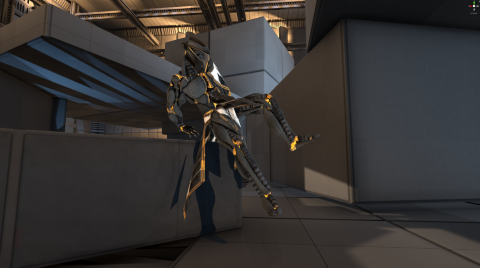
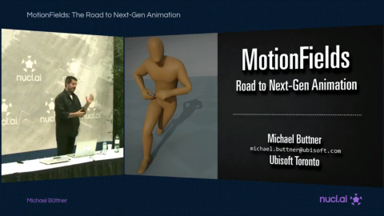
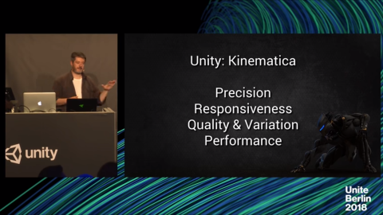
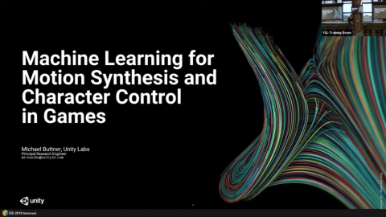

# About Kinematica

Welcome to the documentation page of Kinematica. Here you will be able to access a variety of topics that get you started using the new Unity character animation system.

Kinematica allows to create animated character from raw unstructured motion data (animation clips or motion capture data). This [demo](https://youtu.be/1Jt0F8F3ahY) shows a responsive player-controlled character that
navigates a complex environment, showcasing locomotion, parkour moves with precise environment contacts and
different types of climbing. We only wrote the game logic for this demo and Kinematica produces the animation poses at runtime.

### Disclaimer

This documentation refers to features that available as *preview* and that are under continuous development. This section is a early, incomplete, work-in progress and, as such, contents and features described here are highly likely subject to change.

## Requirements

* Unity 2019.3

# Installing Kinematica

* To install Kinematica into your project you can use the Package Manager UI to add the package by selecting the "All Packages" view.

* As this package resides in the preview packages you can display it by using the "Show Preview Packages" option in the advanced dropdown.

* Then navigate to "Kinematica" and install the package.

For further information, follow the instructions in the [Package Manager documentation](https://docs.unity3d.com/Packages/com.unity.package-manager-ui@latest/index.html). 

# Getting Started

To get started right away with Kinematica, see this [Getting Started](Getting-Started.md) guide.

# Documentation

This section covers the different aspects of Kinematica, its philosophy and the main concepts you will encounter while working with this system.

* [Kinematica concepts and overview](Overview.md)
* [Kinematica Builder Window](Builder.md)
* [Kinematica Query Language](Query-Language.md) 
* [Kinematica Snapshot Debugger](Debugger.md)

For a complete sample project, see: [Kinematica demo](https://github.com/Unity-Technologies/Kinematica) 

## Talks

### Nucl.ai 2015 - Motion Matching - The Road to Next-Gen Animation

### Unite Berlin 2018 - The Future of Character Animation in Unity High Quality Motion Synthesis

### I3D'19 Keynote - Machine Learning for Motion Synthesis and Character Control

