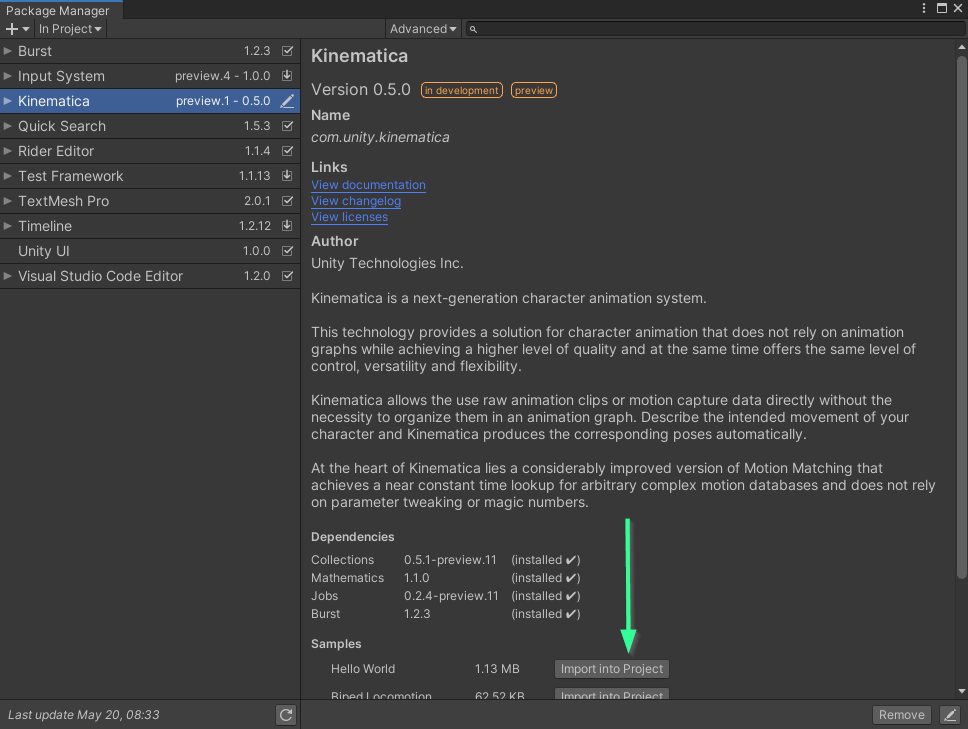
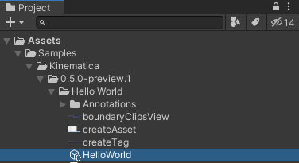
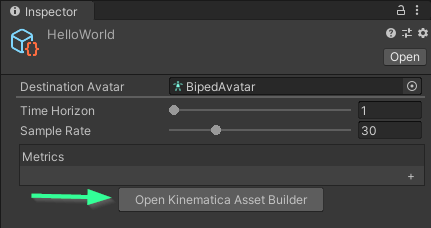
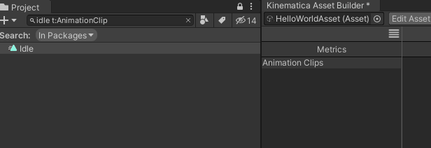
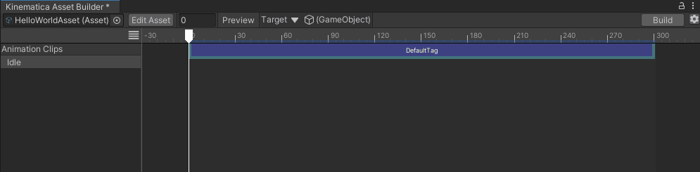
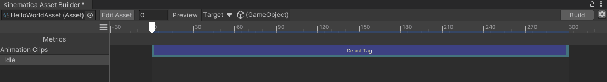
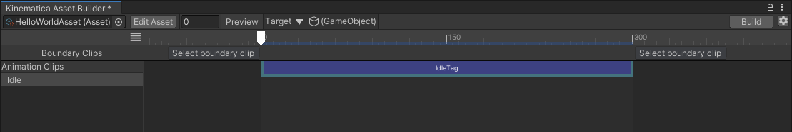
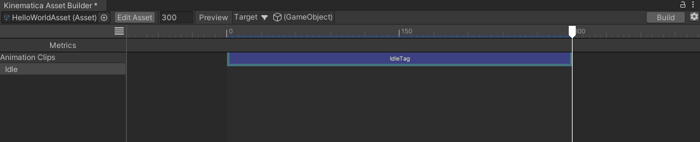
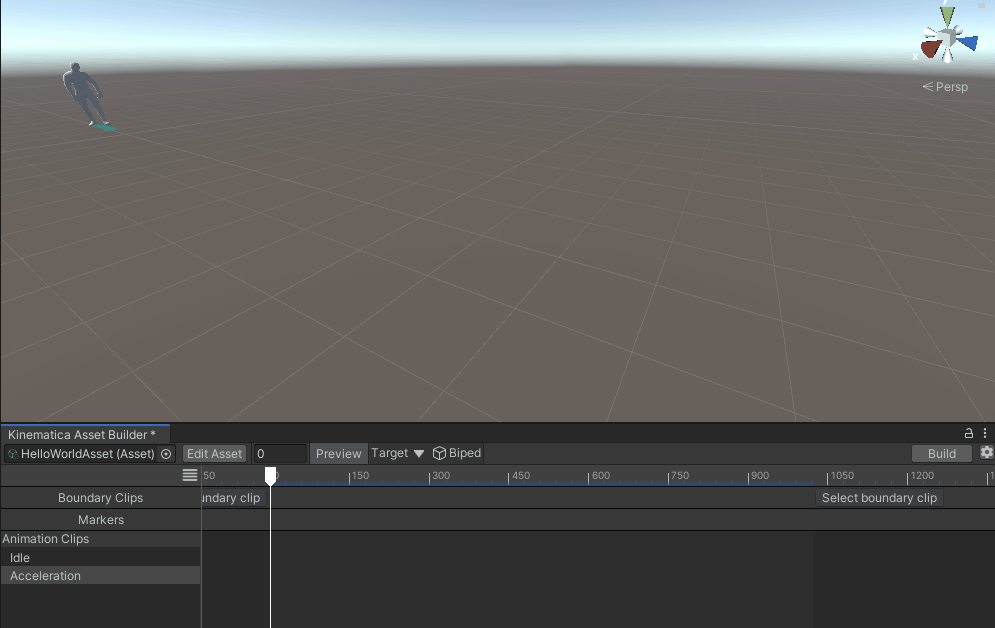
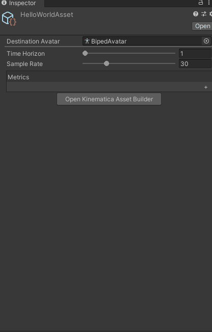

# Hello World

## Purpose

Demonstrate basic locomotion with a biped character with minimal configuration

## How to Use Sample

* Import Sample



* Open the "HelloWorld" Scene
* Locate and select the HelloWorld.asset file in the Project Window



* In the Inspector Window click "Open Kinematica Asset Builder"



* In the Kinematica Asset Builder click the Build button on the top right


* Wait for the build process to finish

* Optional : Select the "Biped" game object from the Target selector in the Kinematica Asset Builder  
Note : When a target is assigned, you will see which animation clips and poses are currently being selected by Kinematica at runtime
* Enter Play Mode

## Creating A Simple Kinematica Scene

Create a Kinematica Asset (Project Window)


Open the Kinematica Builder Window via the InspectorWindow

Now that the asset is being displayed in the Kinematica Asset Builder we can start adding animation clips.

Drag and drop an AnimationClip asset from the project window into the Animation Clips list on the left side of the Asset Builder. The package contains several sample clips, for the remainder of this example we will use the Idle animation clip.



Once the Idle clip has been added to our Animation Library, selecting it in the list view will display the clip's annotations in the Timeline and in the Inspector Window. The Asset Builder automatically adds a Default Tag for the duration of the clip. A tag is an annotated time range of the clip that will be fed to the Kinematica motion library.

## Custom Tag Definition

Next we will create a simple Tag for Idle poses.

Add a new C# Script `IdleTag.cs` with the following code

```
using System;
using Unity.Kinematica;
using Unity.Kinematica.Editor;

[Trait]
public struct IdleTrait
{
    public static IdleTrait Trait => new IdleTrait();
}

[Serializable]
[Tag("IdleTag", "#4850d2")]
internal struct IdleTag : Payload<IdleTrait>
{
    public static IdleTag CreateDefaultTag()
    {
        return new IdleTag();
    }

    public IdleTrait Build(PayloadBuilder builder)
    {
        return IdleTrait.Trait;
    }
}

```

The above code creates a definition for `IdleTag` which will contain `Idle` payloads. Right now our payloads don't contain any information but you can include any blittable type in a tag payload.

`CreateDefaultTag` will get called any time you add a new instance of this tag type on an animation clip. `Build` is called during the Asset build process.

Return to Unity and create a new Idle tag on the Idle animation clip. In the timeline of the Asset Builder either use the context menu (Add Tag -> IdleTag) or mouse click and drag in the empty area of the timeline to add a new Idle tag.



A few more steps before we can use Kinematica to choose poses.

In your scene instantiate the "Biped" prefab that is included in the package.

(Optional) In the Asset Builder set the Target to the newly created Biped, either using the dropdwon menu or drag and drop the game object onto the target element. Setting the target enables previewing of animation poses in the scene view. In play mode, the Asset Builder will also show the currently selected pose.

## Kinematica Component

Create another C# script called SimpleKinematicaScript

```
using Unity.Kinematica;
using UnityEngine;

[RequireComponent(typeof(Kinematica))]
public class SimpleKinematicaScript : MonoBehaviour
{
    void OnEnable()
    {
        var kinematica = gameObject.GetComponent<Kinematica>();
        ref MotionSynthesizer ms = ref kinematica.Synthesizer.Ref;
        ms.Push(ms.Query.Where(IdleTrait.Trait));
    }
}
```

The above component will query Kinematica for the first animation pose that contain our Idle trait and playback the tagged section of the animation clip from there.

Add a SimpleKinematicaScript to your Biped game object. In the automatically added Kinematica component set the `Resource` to your Kinematica Asset.

The final configuration for the Kinematica Asset is to set a Destination Avatar. We can set this by selecting the Kinematica asset in the project window or pressing `Edit Asset` in the asset builder. In the inspector set the Destination Avatar to `Biped Avatar`.

Finally, press the Build button in the Asset Builder. Once the build process has finished enter Play Mode. You will see the idle animation run, however, once it reaches the end of the idle clip, animation stops. There are a few ways to accomplish looping.

## Using Boundary Clips

Exit play mode.

Show the Boundary Clip track by toggling it from the menu



The newly displayed track contains two selectors at either end of the currently display animation clip.



The two selectors should display "Select boundary clip".


Click on "Select boundary clip" to select a boundary clip. Select Idle clip for the post-boundary clip.


Build the asset again.

Enter Play mode.

Now when the end of the Idle clip is reached, Kinematica will start back at the beginning.

## Markers

Another, albeit more complicated way in this simple case, is to use a Marker to force a loop.

Exit play mode and remove the Idle boundary clip (click Idle again in the boundary selector or click 'None').

Create a new C# script called `RewindMarker`.

```
using System;
using Unity.Burst;
using Unity.Kinematica;
using Unity.Kinematica.Editor;

[Trait]
[BurstCompile]
public struct RewindMarkerPayload : Trait {
    public void Execute(ref MotionSynthesizer synthesizer)
    {
        synthesizer.Push(synthesizer.Rewind(synthesizer.Time));
    }

    [BurstCompile]
    public static void ExecuteSelf(ref RewindMarkerPayload p, ref MotionSynthesizer synthesizer)
    {
        p.Execute(ref synthesizer);
    }
}

[Marker("RewindMarker", "Purple")]
[Serializable]
public struct RewindMarker : Payload<RewindMarkerPayload>
{
    public RewindMarkerPayload Build(PayloadBuilder builder)
    {
        return new RewindMarkerPayload();
    }
}
```
The above marker definition simply tells the motion synthesizer to rewind when it is executed.

To add a Marker to the animation clip, drag the playhead of the timeline towards the end of the clip (frame 300). Right click in an empty space in the timeline and click `Add Marker->RewindMarker`. The Marker track will display with a Purple marker at frame 300.



Build the asset again and enter Play Mode. Notice that the animation will loop back onto itself when it reaches the RewindMarker.

## Motion Matching

We'll now add a bit of simple motion matching.

Add the Acceleration animation clip to your Kinematica asset (animation clip included in the package). Feel free to remove the Default tag.

Next we'll create a definition for a Run tag.

```
using System;
using Unity.Kinematica;
using Unity.Kinematica.Editor;

[Trait]
public struct RunTrait
{
    public static RunTrait Trait => new RunTrait();
}

[Serializable]
[Tag("RunTag", "#4850d2")]
internal struct RunTag : Payload<RunTrait>
{
    public static RunTag CreateDefaultTag()
    {
        return new RunTag();
    }

    public RunTrait Build(PayloadBuilder builder)
    {
        return RunTrait.Trait;
    }
}

```

Set the Biped game object as the Target in the Asset Builder in order to make tagging easier. Then, using the in-scene preview as a guide, create some Run tags on the clip.



Next, return to the `SimpleKinematicaScript` component you created and make some modifications. We want to force a trajectory to get the character moving.

```
using Unity.Kinematica;
using Unity.Mathematics;
using UnityEngine;

[RequireComponent(typeof(Kinematica))]
public class SimpleKinematicaScript : MonoBehaviour
{
    Identifier<ActionTask> m_ActionTask;
    void OnEnable()
    {
        var kinematica = gameObject.GetComponent<Kinematica>();
        ref MotionSynthesizer ms = ref kinematica.Synthesizer.Ref;
        ms.Push(ms.Query.Where(IdleTrait.Trait));

        var action = ms.Action();

        ref TrajectoryPredictionTask predictionTask = ref action.TrajectoryPrediction();

        action.PushConstrained(ms.Query.Where(RunTrait.Trait).Except(IdleTrait.Trait), predictionTask.trajectory);

        m_ActionTask = action;
    }


    // Update is called once per frame
    void Update()
    {
        var kinematica = gameObject.GetComponent<Kinematica>();
        ref MotionSynthesizer ms = ref kinematica.Synthesizer.Ref;

        if (m_ActionTask.IsValid )
        {
            ms.Tick(m_ActionTask);

            ref TrajectoryPredictionTask predictionTask = ref ms.GetByType<TrajectoryPredictionTask>(m_ActionTask).Ref;
            predictionTask.linearSpeed = 3f; // 3 m/s
            predictionTask.movementDirection = new float3(0,0,1);
            predictionTask.forwardDirection = new float3(0,0,1);
        }
    }
}
```

The final step is to create a Metric. Open the Kinematica Asset's inspector and click the `+` button in the Metrics list. In the `Tag Types` list, assign the Metric to `RunTag`. Next, set some Joints to the metric, for now we'll choose

* Hips
* Foot_L
* Foot_R



You can view the Metrics track by enabling the Metrics display option in the Asset Builder window.

Build the asset again, notice it takes considerably longer to build as we are performing motion matching training now.

Enter Play Mode.

Notice that the character now runs using some of the selected poses from the Acceleration clip.
You may also notice that not all the poses you tagged are being used, this is because many poses overlap and Kinematica will choose the best matching pose.
