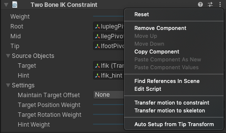

# Bidirectional Motion Transfer

Bidirectional motion transfer is an authoring workflow that lets you transfer existing motion onto active constraints, and inversely, transfer the motion from active constraints back to the original motion source while preserving visual fidelity of the motion. 

This workflow makes use of the Animation Window to select the desired clip and preview the constrained result in the Scene View.

Both **“Transfer motion to skeleton”** and **“Transfer motion to constraint”** are available as options on the **constraint components**. You should use either the **Rig component** to Transfer motion of an entire Rig, or the **RigBuilder component** to transfer motion of the entire hierarchy.

Not all constraints can Transfer motion to constraints. Physics-based constraints like Damped Transform cannot be inferred from existing motion. 

Other constraints can be transferred but with limitations. For example, the Twist Chain constraint constrains rotations. It overrides positions and in-between chain rotations. The result of transferring motion does not precisely represent the source animation.

The following constraints support "Transfer motion to constraint" with limitations:

|Constraint|Limitations|
|---|---|
|Two Bone IK Constraint|No limitations.|
|Multi-Aim Constraint|Roll-Axis motion is not guaranteed to be the same.|
|Multi-Parent Constraint|No limitations.|
|Multi-Position Constraint|Disabling constrained axes may change end result|
|Multi-Referential Constraint|No limitations.|
|Multi-Rotation Constraint|Disabling constrained axes may change end result.|
|Twist Chain Constraint|In-between chain transforms are overridden.|
