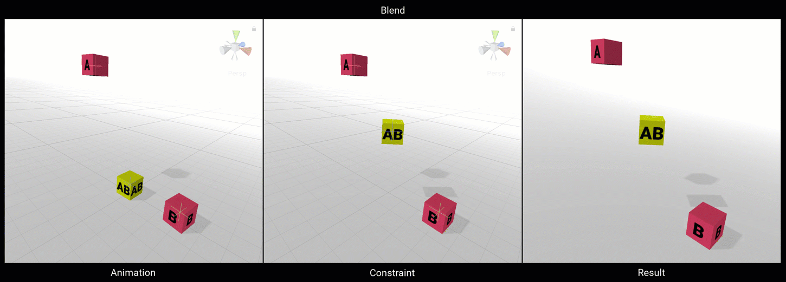
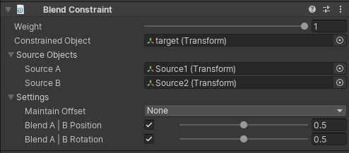

# Blend Constraint

A blend constraint allows the constrained GameObject to blend between GameObject Source A Position
and GameObject Source B Position as well as blending between GameObject Source A Rotation
and GameObject Source B Rotation.

|Properties|Description|
|---|---|
|Weight|The weight of the constraint. If set to 0, the constraint has no influence on the Constrained Object while when set to 1, it applies full influence given the specified settings.|
|Constrained Object|The GameObject affected by the Source GameObjects|
|Source A|The Source A Gameobject that influences the position and rotation of the Constrained Object|
|Source B|The Source B Gameobject that influences the position and rotation of the Constrained Object|
|Maintain Offset|The offsets (in Position, Rotation or both) between the source and constrained objects are maintained when not set to None|
|Blend A - B Position|If enabled, the constrained GameObject gets the resulting blended position given from Source A and Source B|
|Blend A - B Rotation|If enabled, the constrained GameObject gets the resulting blended rotation given from Source A and Source B|