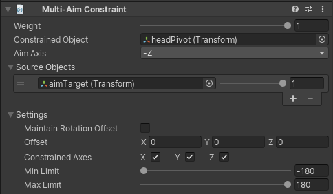

# Multi-Aim Constraint

A Multi-Aim Constraint rotates a GameObject to face its source GameObject. It is typically applied on a GameObject
to follow around one or more GameObjects. You can specify the aim direction by specifying the Aim Axis to the desired
vector (X, -X, Y, -Y, Z, -Z).  Optionally, you can also specify the world up direction to help the constrained GameObject
maintain its upward position.

|Properties|Description|
|---|---|
|Weight|The weight of the constraint. If set to 0, the constraint has no influence on the Constrained GameObject while when set to 1, it applies full influence given the specified settings.|
|Constrained Object|The GameObject affected by the constraint Source GameObjects|
|Aim Axis|Specifies the local aim axis of the constrained Object to use in order to orient its forward direction to the Source Objects.|
|Up Axis|Specifies the local up axis of the constrained Object to use in order to orient its upward direction to the Source Objects.|
|World Up Type|Specifies which mode to use to keep the upward direction of the constrained Object.|
|World Up Vector|A static vector in world coordinates that is the general upward direction.  This is used when World Up Type is set to WorldUpType.Vector.|
|World Up Object|A GameObject used to calculate the upward direction.  This is used when World Up Type is set to WorldUpType.ObjectUp or WorldUpType.ObjectRotationUp.|
|Source Objects|The list of GameObjects that influence the constrained GameObject orientation. Unity evaluates source GameObjects in the order that they appear in this list. This order affects how this constraint rotates the constrained GameObject. To get the result you want, drag and drop items in this list. Each source has a weight from 0 to 1.|
|Maintain Rotation Offset|Maintain the current rotation offset from the constrained GameObject to the source GameObjects|
|Offset|Apply and extra post rotation offset to the constrained object. Specified in local space.|
|Constrained Axis|Check X, Y, or Z to allow the constraint to control the corresponding axis. Uncheck an axis to stop the constraint from controlling it.|
|Min Limit|Clamps the minimum value of the rotation axis along which the constraint GameObject rotates|
|Max Limit|Clamps the maximum value of the rotation axis along which the constraint GameObject rotates|

World Up Type can have the following values:

|Values|Description|
|---|---|
|None|Do not use a World Up vector.|
|Scene Up|The Y axis of the scene.|
|Object Up|The Y axis of the GameObject referred to by __World Up Object__.|
|Object Up Rotation|The axis specified by __World Up Vector__ of the GameObject referred to by __World Up Object__.|
|Vector|The World Up Vector.|
