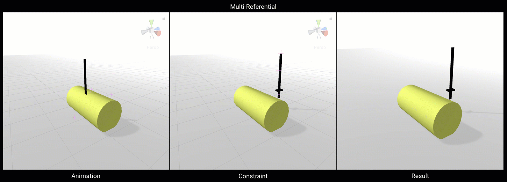
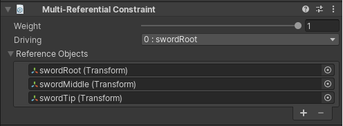

# Multi-Referential Constraint

The Multi-Referential Constraint allow the user to set a parent-child like behavior between a group of GameObjects.
The selected driving GameObject acts as the parent to the rest of the referenced GameObjects specified.
Any Reference Objects can be set has the current Driving GameObject to influence the others.

|Properties|Description|
|---|---|
|Weight|The weight of the constraint. If set to 0, the constraint has no influence on the Referenced GameObjects while when set to 1, it applies full influence given the specified settings.|
|Driving|A given Referenced GameObject that is set as the driving parent to all other Referenced GameObjects.|
|Referenced Objects|A list of GameObjects to be driven by the specified driver.|
