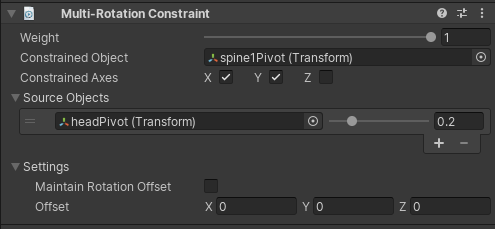

# Multi-Rotation Constraint

A Rotation Constraint component rotates a GameObject to match the rotation of its source GameObjects.

|Properties|Description|
|---|---|
|Weight|The weight of the constraint. If set to 0, the constraint has no influence on the Constrained GameObject while when set to 1, it applies full influence given the specified settings.|
|Constrained Object|The GameObject affected by the constraint Source GameObjects|
|Constrained Axis|Check X, Y, or Z to allow the constraint to control the corresponding local rotation axis. Uncheck an axis to stop the constraint from controlling it.|
|Source Objects|The list of GameObjects that influence the constrained GameObject orientation. Unity evaluates source GameObjects in the order that they appear in this list. This order affects how this constraint rotates the constrained GameObject. To get the result you want, drag and drop items in this list. Each source has a weight from 0 to 1.|
|Maintain Rotation Offset|Maintain the current rotation offset from the constrained GameObject to the source GameObjects|
|Offset|Apply and extra post rotation offset to the constrained object. Specified in local space.|
