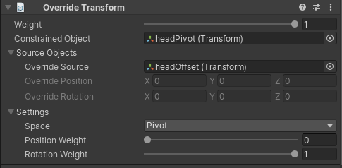

# Override Transform

An Override Transform constraint allows to override the constrained GameObject transform in a specific space.
In World Space, the Global Transform values of the Constrained GameObjects is replaced by the displacement of
the Override Source local transform values. In other words, at constraint creation the current position of the Override Source GameObject is considered the world origin.
In Local Space, the Local Transforms values of the Constrained GameObjects is replace by the displacement of
the Override source local transform values. Finally, in Pivot Space the displacement of
the Override source local transform values are added to the current Constrained GameObject transform behaving like an additive transform layer.
For each Space you can either use an Override Source GameObject or Override Position/Rotation fields to set precise numerical values.

|Properties|Description|
|---|---|
|Weight|The weight of the constraint. If set to 0, the constraint has no influence on the Constrained GameObject while when set to 1, it applies full influence given the specified settings.|
|Constrained Object|The GameObject affected by the Override source.|
|Override Source|The GameObject that influence the constrained GameObject transform. When specified, Override Position and Rotation fields are ignored.|
|Override Position|Override position values to apply to the Constrained GameObject. Ignored if an Override Source is specified.|
|Override Rotation|Override rotation values to apply to the Constrained GameObject. Ignored if an Override Source is specified.|
|Space|World, Local or Pivot space options|
|Position Weight|The weight of the position influence. A weight of 1 causes the constrained GameObject to be fully influenced by its Override source.|
|Rotation Weight|The weight of the rotation influence. A weight of 1 causes the constrained GameObject to be fully influenced by its Override source.|