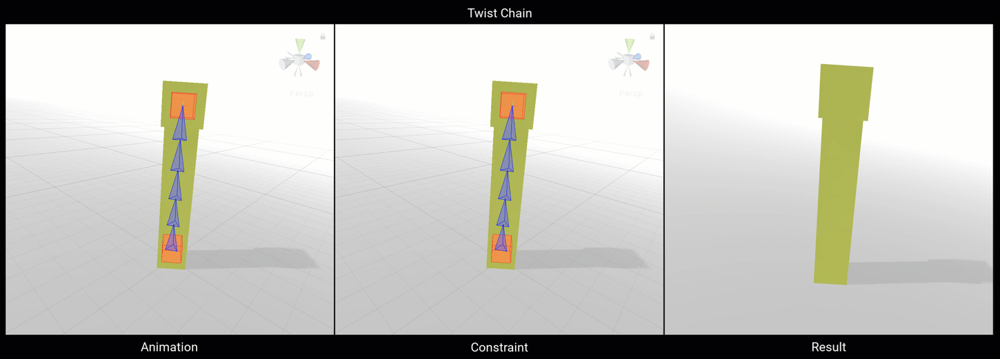
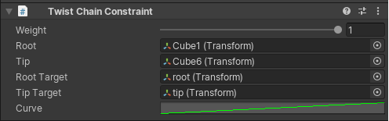

# TwistChain Constraint

The Twist Chain constraint allows to control world rotations on both ends of a GameObject chain hierarchy.
Root and Tip rotations are interpolated along the chain to in-between GameObjects to create a smooth
animated hierarchy.

|Properties|Description|
|---|---|
|Weight|The weight of the constraint. If set to 0, the constraint has no influence the elements of the chain while when set to 1, it applies full influence given the specified settings.|
|Root|The chain hierarchy root GameObject.|
|Tip|The chain hierarchy tip GameObject.|
|RootTarget|The GameObject that affects the constrained chain root GameObject rotation.|
|TipTarget|The GameObject that affects the constrained chain tip GameObject rotation.|
