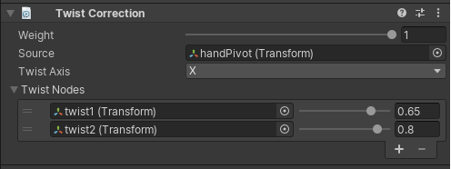

# Twist Correction

Twist correction is mainly use to redistribute a percentage of the source rotation over a
leaf bone in order to correct the Twist deformation of the mesh body part.

|Properties|Description|
|---|---|
|Weight|The weight of the constraint. If set to 0, the constraint has no influence on the Twist Nodes while when set to 1, it applies full influence given the specified settings.|
|Source|The GameObject that influences the Twist Nodes to rotate around a specific Twist Axis|
|Twist Axis|The Source GameObject local axis from which the rotation is extracted and then redistribute to the Twist Nodes|
|Twist Nodes|The list of GameObjects that will be influenced by the Source GameObject.|
