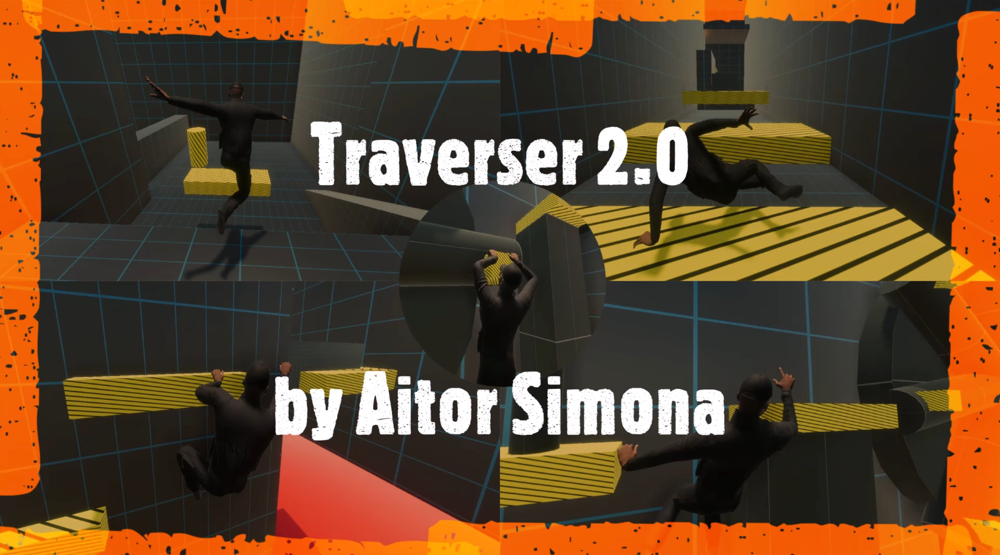

# Traverser 2.0

### *By [Aitor Simona](https://aitorsimona.github.io/)*

Traverser is a free and open source player traversal toolkit featuring Locomotion, Parkour and Climbing. 
Includes procedural animation, physical animation, custom motion warping and root motion. 
It is self-contained in a set of scripts. Use the given abilities or expand the system 
through its shared ability workflow.

## SHOWCASE 

<iframe width="854" height="480" src="https://www.youtube.com/embed/Q-7dArXpln8" title="YouTube video player" frameborder="0" allow="accelerometer; autoplay; clipboard-write; encrypted-media; gyroscope; picture-in-picture" allowfullscreen></iframe>

## DOWNLOAD

[Unity Asset Store](https://assetstore.unity.com/packages/tools/game-toolkits/traverser-player-traversal-toolkit-201063)

[Demo Build](https://github.com/AitorSimona/Traverser/releases/download/2.0/Traverser_v2.0_Demo.zip)

[Demo Project](https://github.com/AitorSimona/Traverser/releases/download/2.0/Traverser_v2.0_DemoProject.zip)

[Asset](https://github.com/AitorSimona/Traverser/releases/download/2.0/Traverser_v2.0_Asset.zip)

## FEATURES 

### Tools 

| Custom Character Controller    | Custom Motion Warping | Procedural Animation | Physical Animation |
| -------------                  | -------------         | -------------        | ------------- |
| Extends Character Controller   | Linear/Weighted       | Runtime rigging      | Active ragdoll |   
| Predictive Collision Detection | Custom Root motion    | Aim IK               | Ragdoll profiles / blending |
| Simulation                     |
| Ground Snap                    |

### Abilities 

| Locomotion                     | Parkour        | Climbing |
| -------------                  | -------------  | ------------- |
| Movement & Rotation            | Vaulting       | Procedural ledge climbing - No Annotations | 
| Jump / Grab ledge              | Sliding        | Nearby ledges |
| Hard and Fall to roll landings | Ledge to ledge | Ledge to ledge |
| Feet IK |                                       | Moving ledges |
|                                |                | PullUp / DropDown / JumpBack |                                                  
|                                |                | Free hang |     
|                                |                | Aim IK |     

## INPUT

| Action        | Gamepad       | Keyboard/Mouse |
| ------------- |:-------------:|:-------------:|
| Movement      | Left Joystick |      WASD     |
| Look          | Right Joystick|     Mouse     |
| Run           | Left Joystick Button | Left Shift  |
| Jump          | North Button  | Q |
| Drop          | East Button | C  |
| Climb         | East Button | C  |
| Vault/Slide   | South Button | Space  |
| Jump from ledge | South Button | Space  |
| Jump to ledge   | West Button | Left Shift  |
| Pull Up from ledge   | North Button | Q |

## ISSUES

If you encounter a bug, or want to suggest an idea, just drop it in the issues section.

## DEPENDENCIES

| Packages    |
| -------------                  |
| Animation Rigging   |
| Cinemachine |
| Input System                     |
| Demo uses HDRP                    |

## CONTACT

[LinkedIn](https://www.linkedin.com/in/aitor-simona-bouzas-aab43817b/)

[Mail](simonaaitor@gmail.com)

## TOOLS USED

[Microsoft Visual Studio](https://visualstudio.microsoft.com/) 2019

[Unity](https://unity.com/) 2020.2.2f1

[Kinematica](https://docs.unity3d.com/Packages/com.unity.kinematica@0.8/manual/index.html) 0.8 demo assets

[Mixamo](https://www.mixamo.com/#/) character and several animations

[Autodesk Maya](https://www.autodesk.com/products/maya/overview) 2019

## Special thanks / References

[Unity](https://unity.com/)

[Kinematica](https://docs.unity3d.com/Packages/com.unity.kinematica@0.8/manual/index.html)

[Guerrilla Games](https://www.youtube.com/watch?v=LrLHsbTK5bM&ab_channel=GDC)

[The Coalition](https://www.gdcvault.com/play/1024219/Motion-Warping-in-Gears-of)

[Naughty Dog](https://www.youtube.com/watch?v=7S-_vuoKgR4&ab_channel=GDC)
